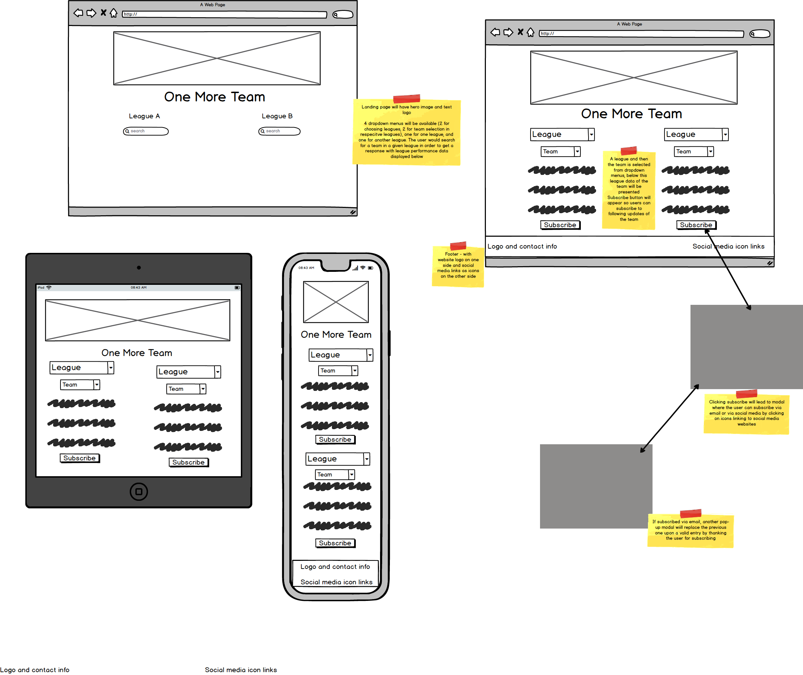

# One More Team

This website will serve the purpose of helping football fans to be able to conveniently get relevant information on
the team they support. The aim will also be to gives fans the chance to compare two teams beside one another from different leagues, and
support the longer-term goal of the website to give fans one more team to support. The website will inform users about:
* Information on any team they search for (league standing, next game, contact information, club website)
* Compiled data on teams and their league performances overv the past 3 years
* What team they could support, based on how their team performs vs. a foreign team with similar league performance

By looking to engage fans to support more than one team, this can help make the sport more exciting for the fan in terms of more sports content
to follow. In terms of commerical opportunties, this can bring potential in drawing in new, foreign fan bases for teams and support globalization
of sport. This would all be done by providing two search functions - one to check current league perormance and next game information, and the other
providing a way to compare two teams based on league performance over the last 3 years.

### Business goals:
* To provide a new revenue streams for sport teams/clubs by providing a new way to obtain international fan bases
* By providing new revenue streams for sports teams/clubs, subsequently would look to obtain revenue in the form of commission in providing
potential new customers/fans
* To build an exciting application for the developer's portfolio, this being an idea he'll want to develop further in the future

### Goals of users/sports fans:
* To conveniently and efficiently check up on relevant information on the team(s) they support
* To give inspiration for choosing a team in another geographic region to support

## UX

### Ideal User

#### Users visiting my website would be:
* From anyone in the world
* A football fan
* English speaking

#### Users on my website will want to:
* Get inspiration for another team to support in a foreign league
* Have an efficient and convenient way on updating themsleves on a given team's league performance
* Be directed to where they can find more information on a given team(s)

#### Why this website is a great solution:
* Currently in the football industry there is no clear advisor for fans who would want to add to the teams(s) they support
* Curious fans and/or fans who live and work abroad do not have any basis/support in finding a team to follow in the new country they reside in
* The solution can contribute towards greater globalisation of the sport, helping football teams/clubs themselves to become more international
* More international fans can lead to new streams of commerical activity for foreign leagues and teams (through advertising game broadcasting, merchandise etc.)

### User Stories
1. As a new visitor to the website, I want it to be very clear as to what the purpose of the website is
2. As a new visitor of the website, I want to get concise and relevant league statistics of the team(s) I follow
3. As a new visitor of the website, I would like some inspiration for a team in a foreign league to support, either out of curiosity or because I want to localize myself in a new country
4. As a potential customer, I want to be able to subscribe to a team(s) so I can receive automatic updates/news via email
5. As a potential customer, I want to have more information about a team(s), where I can be easily redirected to a club/team website to find commercial offerings
6. As a potential customer/observer, I want social media links available so I can easily access a club/team's social networking activities
7. As a an observer, I want to be able to get in touch with the website owner and be able to access social media related to the website
8. As a visitor of the website, I want an error free user experience, with clear communication from the website if something goes wrong

### Design Choices

#### Overall Inspiration:

[This blog post][1] inspired a number of my style choices when creating the website/application.

#### Font
Sans-serif was my font of choice, as it is a font that is easy to read and allows users to focus more on the other design aspects 
and functionality of the website.

#### Icons
I used Font Awesome icons for my social media link icons in my footer - this being a visually appealing way to indicate to 
users how to access website-related social media pages

#### Colours

I drew inspiration from [this blog post][2] for my colour scheme that ended up predominately following the SCUBA theme, consisting of coral, 
ice blue, grey and teal. I felt this colour scheme could effectively draw the user’s focus better on the main parts of the 
website/application. These main aspects included the call to actions to direct users through the application journey as well as highlighting
the main team match-up feature.

#### Hero Header section

Drawing from the main sport website inspiration blog post, videos as backgrounds were suggested and I felt this would have 
a positive impact on users first arriving to the website. The call to action follows the recommendation of what is common for 
good websites in general to ensure good UX performance. In terms of implementing the video background, I used 
[this Youtube video][3] for inspiration. The actual video itself I obtained as a free stock video from Pexels.com.

#### Information Section

Followed inspiration for design from [this Youtube video][4]. This design is for service 
information on a website. Since I felt that the application that’s on offer is a type of service, I felt this design could be a 
good way to explain the concept to users as easily as possible. Especially, since the concept is new for football fans, I felt 
it was very important to have a design that can clearly convey information. The bolder call to action helps direct users further 
on to the next section once they’re done reading. Hover animations on the information boxes helps users to focus on a particular 
section they’re reading.

#### Team Match-Up Section

I used the attention-grabbing colours of my chosen colour scheme (coral, teal) to emphasize this section and feature, to inform 
users that this is the main feature of the user experience to engage with. To give an easy reading experience for users, I chose 
a white background for the team stats and graphs once they’ve appeared. These phase into the page through a slide-down animation 
to give users a smooth transition from selection to results displaying. I replicated many styles from the information section, 
changing only the colours, in order to give the website a more consistent feel.

### Wireframes
I used the tool Balsamiq in order to create my wireframe. I prodcued one png file that has wireframe images of the idea on desktop, mobile and tablet.
The reason that this wireframe is vey concise is that my initial thoughts were that the design of the webpage would be more concise than
how then end product of my project looks like.

## Features

### Existing Features

####  1. Hero Header
* Upon arrival to the website the user is greeted with a hero video of a camera panning around a football stadium from a sky view to give an impactful, football-related introduction. This is couple with a simple text logo with a slogan
* Simple call to action button ‘Get Started’ to direct users to the next section

##### Differentiations from Wireframe
* Placed Website logo test and slogan over the hero media instead
* Used a video as the background instead of a static image
* Made the hero header section cover full width and height of viewports
* Placed call to action button which directs users to the next section of the website

#### 2. Information section
* Call to action from the Hero Header section brings the user to the About section with information about the application. This aims to inform users the purpose of the website/application, how it works, and information of features for the future
* Tooltip is provided on the underlined test in the first information box, giving more information about traditional football fan behaviour, which could help users who are less familiar with the sport and the fan culture. 
* Slide up animation when users hover mouse over on desktop (press on smartphone/tablet) on the information boxes helps to give some user feedback and assistance in reading specific information boxes
* Simple call to action at the bottom with the text ‘Find Your team’ again helps users to be directed to the next step without having to scroll down

##### Differentiations from Wireframe

* This section was not drafted at all in the wireframe - added to give greater clarity to users

#### 3. Team Match-Up section
* Call to action from the Information section directs users to this section, where two dropdowns for selecting a league and two dropdowns for team selection are available
* User can select a team with the default set leagues or changes the league(s) he/she wishes to generate their recommendation with.
* Upon user selecting a league(s) and a team, the feature generates league statistics and a pie chart of games won, drawn, and lost for their chosen team as well as their recommended team based on current league position
* When the user changes the league in one of the league dropdown menus, the previous results will clear to give a clean space so a new set of results to generate in once the user makes another team selection
* Animations on team data slide down and sliding up provide smooth transitions
* When a team selected does not successfully load its image from the API, a placeholder image and error message below are put in place for clear user feedback on the server/API error

##### Differentiations from Wireframe
* Addition of pie charts to visualize certain league statistics of the teams
* This feature having its own section covering the full width and height in terms of viewports
* No subscribe button and subsequent modals (reasoning for this further explained in ‘Features Left To Implement’)

#### 4. Footer
* Simple footer provides social media icon links to different social media platforms, where users can be redirected to relevant social media pages related to the website/application
* An email is provided as additional information on how to get in contact with the website owner, plus information about the the developer of the website and application

##### Differentiations from Wireframe
* The contents of the foooter are centered from the start instead of having contact details/website information on one side and the social media links on the other
side. This choice was made since the developer felt, from a design perspective, content being centered had an appealing look in all the different size formats (desktop, mbile and tablet)

#### 5. API Error Modal
* Since the API used in this project for football data allows only 10 calls per minute on a free account, the need for user feedback is apparent in regards to if the user makes too many selections in quick succession and/or too many users using the website
* A simple and straightforward modal appears when this API error appears in the screen through a fade in animation, indicating to the user to please wait a minute in order to get the data requests working again

##### Differentiations from Wireframe
* This feature was not included in the wireframe, where this scenario had not been accounted for yet at the time of drafting up the wireframe

### Features Left to Implement
#### 1. Subscribe feature, 
In the wireframe I set the ambition to have a Subscribe feature, where a button is present under each teams’ stats and graphs. 
This button would produce a modal with a form to enter the user’s email address, and once submitted, exits the modal and a quick 
pop up message appears thanking the user for subscribing. The user would then receive an email informing him/her which team they 
have subscribed to. This requires implementation of the EmailJS API, which unfortunately was not possible within the time scope 
of this project.

#### 2. Access to more team statistics 
In the future, users could filter their team recommendation generation based on different statistics and time periods 
eg. (number of goals scored over two seasons). This would also include the need for form elements such as radios and/or 
checkboxes to implement these filters. This would add greater complexity to the Javascript code, and due to the short 
time scope of the project, this wasn’t possible to implement.

#### 3. Having more leagues to choose from 
This version of the website is only using the leagues that can be provided on a free account with the chosen API.
To increase the amount of leagues to choose from would require financial investment into a paying account of the API.

## Technologies used

This project has included the use of HTML, CSS and Javascript programming languages.

* [JQuery][5] - used to simplify some DOM manipulation for certain functions
* [GitPod][6] - The developer used this tool as their IDE when building this project
* [Bootstrap][7] - Utilized to simply html structure of website and responsiveness of it. [Popper][10] also used to be able to enable some Bootstrap functionality
* [GitHub][8] - This project used GitHub to be able to store the project remotely and then be able to deploy the project
* [FontAwesome][9] - Icons in the footer section for social media links coming from this resource
* [Football-data.org][11] - API used by developer in order to retrieve football data that is displayed in the web page
* [ChartJS][12] - Developer chose specific stats to display visually in a pie chart using this chart making API

## Testing

All information about the testing procedures I conducted can be found here in a separate testing.md file

# Deployment

I developed this project in [GitPod IDE][6], where I would commit to Git, and then push to GitHub via using the terminal in GitPod. I deployed this [Github repository][13] to GitHub Pages via the following process:
* Logged into GitHub
* Under the tab 'Repositories', I selected **Milestone-Project_2**
* Subsequently I selected **'Settings'** from the menu at the top of the page
* I scrolled down the page top the **GitHub Pages** section
* On the dropdown bar under 'Source', I selected **'master branch'**
* Once I selected 'master branch' the page reloaded, and the website was deployed
* I scrolled down the page again to find the **link** to the deployed website within a green highlighted area of the GitHub pages section, where this section also notified me that my website is deployed

The master branch was the only branch used for this website.

## How to run the project locally

To clone the project from Github:

1. Click the following link to come to the [GitHub repository][13] for this project
2. Click on the green button 'Clone or Download'
3. A dropdown window will appear titled 'Clone with HTTPS' - copy the link provided in the field below
4. Open your local IDE
5. Change the current working directory to the location where you want the cloned directory to be made
6. Type in <code>git clone</code>, followed by pasting in the url copied from Step 3 alongside the git command.
7. Press Enter, and the clone should subsequently be created

Further troubleshooting on how to run the project locally can be found [here][14].

## Credits

Video by Kelly Lacy from Pexels: https://www.pexels.com/video/soccer-game-in-a-stadium-2657257/
Code for displaying video files onto html page: https://www.w3schools.com/html/html5_video.asp
Code from StackOverlfow on additonal attributes needed for video to work, these being 'muted' as browser requirement, and 'playsinline' for mobile adaptability:
https://stackoverflow.com/questions/10377453/play-infinitely-looping-video-on-load-in-html5
Video I coded along to in order to understand how I could make a header section with a video as the background:
https://www.youtube.com/watch?v=Xy3GlrddZFI
Video walkthrough to give inspiration for design on information section: https://www.youtube.com/watch?v=nuOVuLrjioM

[1]: <https://www.templatemonster.com/blog/9-essential-sport-web-design-features/>
[2]: <https://www.shutterstock.com/blog/10-gorgeous-color-schemes-for-websites?kw=&gclsrc=aw.ds&gclid=Cj0KCQjwjcfzBRCHARIsAO-1_OrJR392xwRrdV2yWgI1RkCL5Vk_T44YppPBg32ONw8TTXwgM-ysdQYaAlm_EALw_wcB>
[3]: <https://www.youtube.com/watch?v=Xy3GlrddZFI>
[4]: <https://www.youtube.com/watch?v=nuOVuLrjioM>
[5]: <https://jquery.com/>
[6]: <https://gitpod.io/>
[7]: <https://getbootstrap.com/>
[8]: <https://github.com/>
[9]: <https://fontawesome.com/>
[10]: <https://popper.js.org/>
[11]: <https://www.football-data.org/>
[12]: <https://www.chartjs.org/>
[13]: <https://github.com/Ljungwaldh/Milestone-Project_2>
[14]: <https://help.github.com/en/github/creating-cloning-and-archiving-repositories/cloning-a-repository>
[15]: <>
[16]: <>
[17]: <>
[18]: <>
[19]: <>
[20]: <>
[21]: <>
[22]: <>
[23]: <>
[24]: <>
[25]: <>
[26]: <>
[27]: <>
[28]: <>
[29]: <>
[30]: <>
[31]: <>
[32]: <>
[33]: <>
[34]: <>
[35]: <>
[36]: <>
[37]: <>
[38]: <>
[39]: <>
[40]: <>
[41]: <>
[42]: <>
[43]: <>
[44]: <>
[45]: <>
[46]: <>
[47]: <>
[48]: <>
[49]: <>
[50]: <>